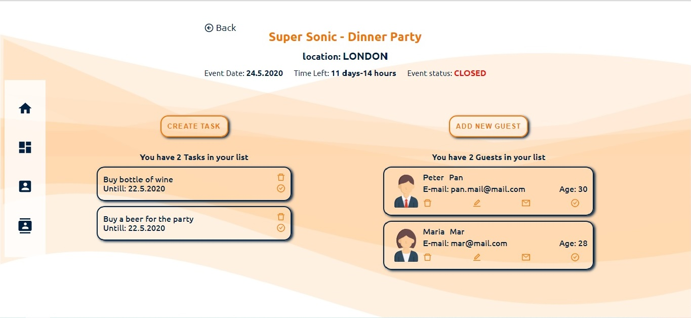

# event-planner-app
 React, Express, Node, MongoDB - Event Planner App
 

 - Log-in
 - Registration
 - Reset Password

 
 - Add Event
 - Edit Event
 - Delete Event
 - Event Status ( Close/Open - invited/expected Guests - Time Left until Event start)
 - Menu is not ready yet!!

 - Add Guest or Task
 - Delete Guest or Task
 - Update Guest
 - Update Task or Guest status (isDone for Task, isConfirmed for Guest)
 - Send invitation Email
 
 
User Authentication
Reset Password - 75% done
Event List 
ToDo List for every event
Guest List for every event
Sending Emails to Guests - SendGrid, NodeMailer
  

  *To Do more*
  - Finish Reset Password
  - Delete Events with all subDocuments 
  - Finish Guests Menu
  
